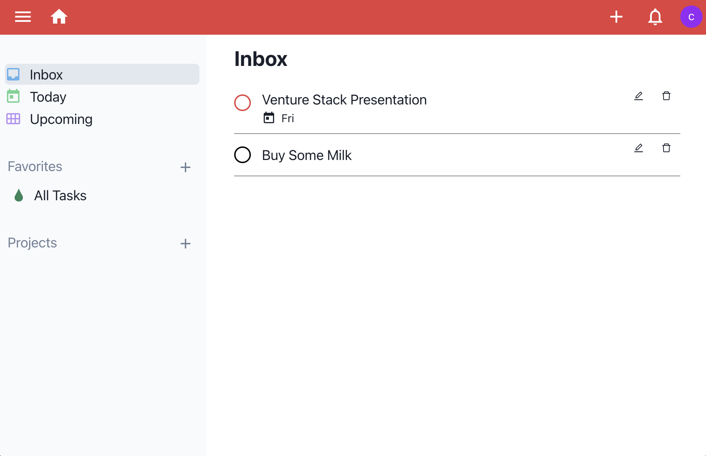
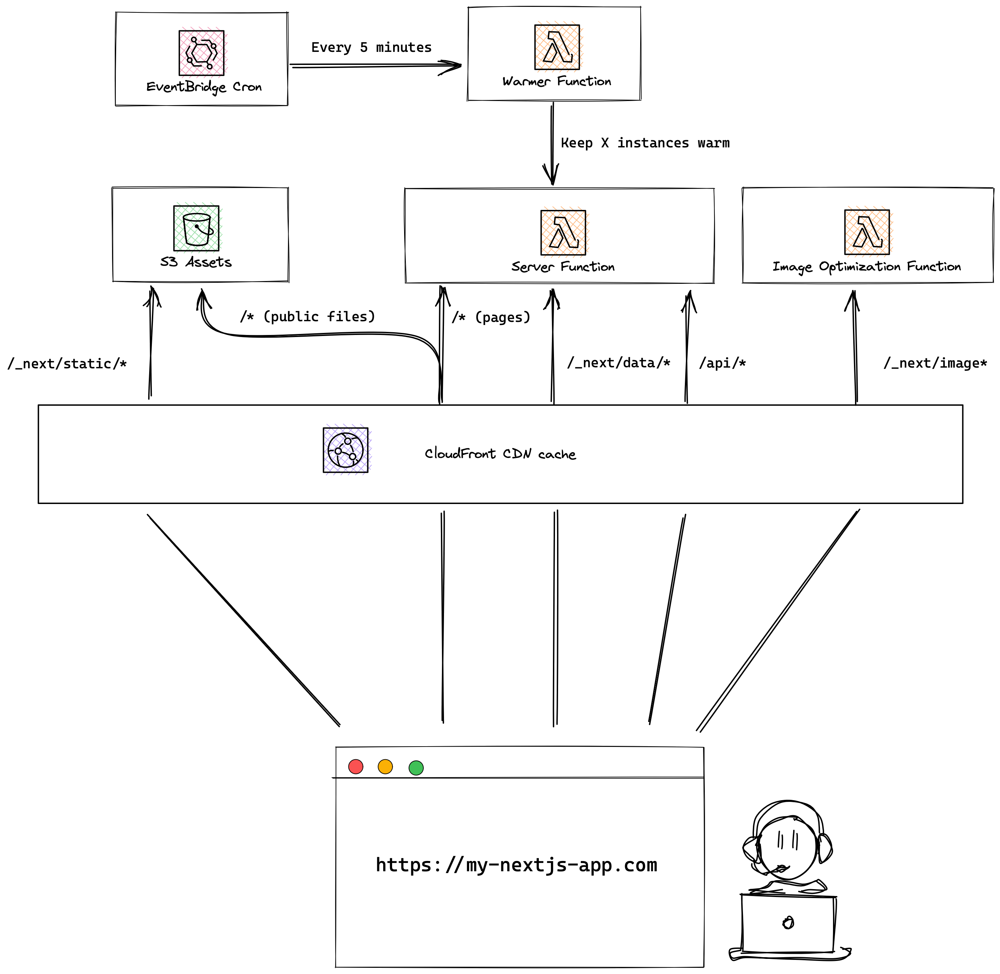
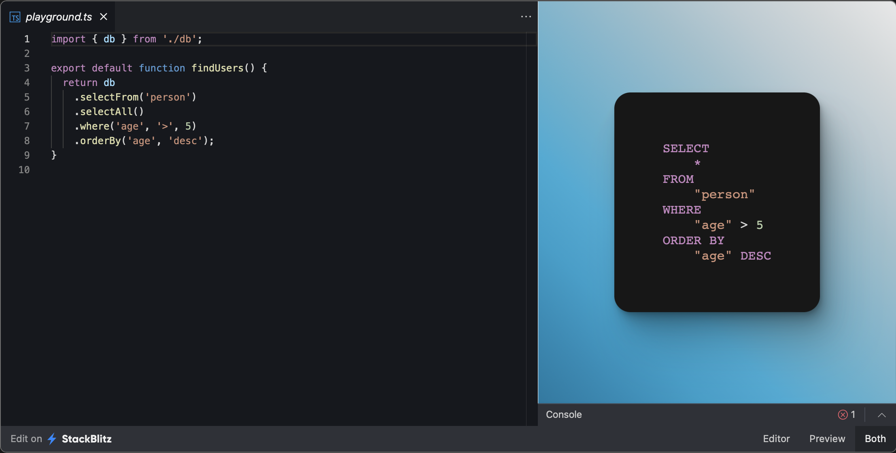
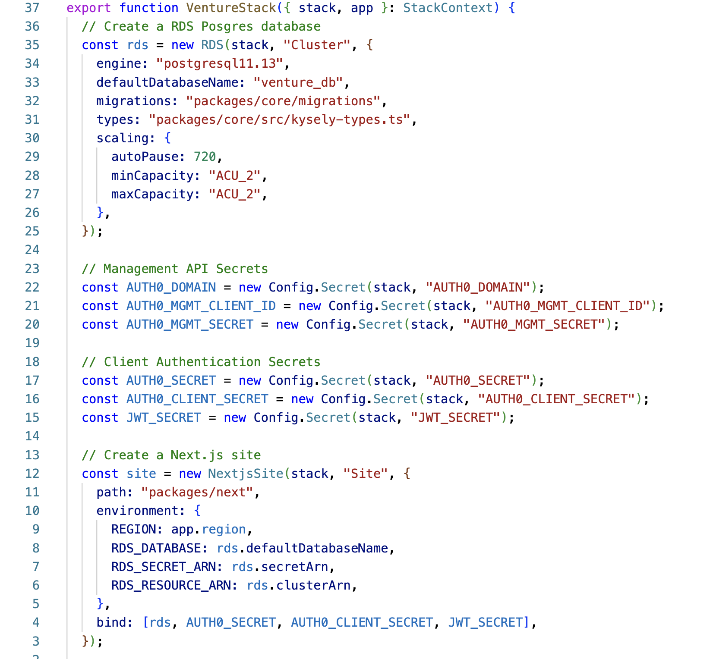

# VentureStack

VentureStack is an AWS cloud development template, designed to let teams focus their time on product engineering, by taking the hassle and complexity out of AWS deployments.

VentureStack is opinionated, it prescribes the languages, frameworks and development techniques you use. Its overarching objective is to minimize the breadth of frameworks your team must grasp to successfully deliver a product.

## Guides

Want to get started? Check out our guides.

* [Development Guide](./docs/DEVELOP.md)
* [Scheme Migration](./docs/SCHEMA.md)
* [Authentication](./docs/AUTH.md)
* [Logging and Instrumentation](./docs/SENTRY.md)
* [Cron and Asynchronous](./docs/CRON.md)

## Components

* Udoit - A React demo application with APIs, Cron Jobs, Queues, Aurora Postgres RDS, Schema Migration, Secrets, Auth0 and Sentry.io
* Next.Js - A framework for building full-stack Web applications. Supports CSR, SSR, APIs and static content
* Kysely - A type-safe SQL query builder for TypeScript. No ORM magic just SQL
* SST - A framework that makes it easy to deploy full-stack applications on AWS

### Udoit

Udoit is a task manager starter application.

The starter application demonstrates:

* Client Side Rendering, REST APIs and RDS Aurora Postgres data storage.
* Kysely schema migrations, type generation and queries
* Secrets management with AWS Parameter Store
* Auth0 client authentication
* Sentry.io browser and server-side instrumentation
* A Cron triggered batch job with SQS event handler (Synchronises Auth0 user metadata to RDS).

### Next.JS

Full-stack Web application framework using React, Next.JS supports:

* Client Side Rendering, Server Side Rendering
* Static Site Generation, Incremental Site Generation
* Image optimization
* Middleware

Next Apps are deployed on AWS as Lambda functions and S3 with CloudFront, includes an optional warmer function to avoid cold starts.

## Kysely

Kysely (pronounce “Key-Seh-Lee”) is a type-safe and autocompletion-friendly typescript SQL query builder.

Key concepts:

* Type-safe queries - Kysely lets you write type-safe SQL queries. This eliminates entire classes of errors and lets you sleep peacefully at night.
* No magic, just SQL - Kysely is a light abstraction layer over SQL. This makes it easy to reason about performance and reduces the number of concepts you need to learn to be proficient with the library.

## SST

Is an open-source framework for deploying full-stack web applications to AWS:

Key concepts:

* Infrastructure made easy with Typescript, simple constructs and sensible defaults
* Development and testing on the cloud, no local environment setup
* Schema Migration - supports evolving the structure of a database schema over time.
* Deploy environments with one command from the CLI
* Lambda function debugging with VS Code
* Dev console for database and log access
* Expand and add any AWS service using CDK.

