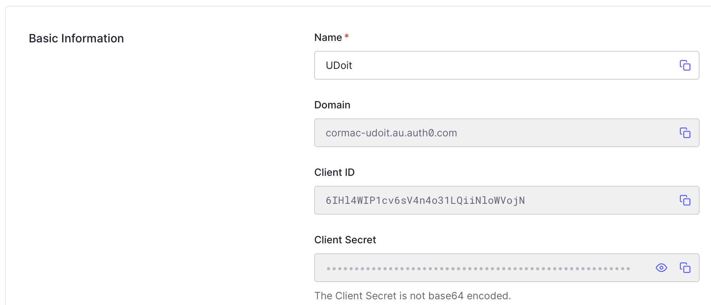

# Authentication

By default, user credentials are hashed and stored in the `user` table in RDS. While local user management is convenient for development it should never be used in testing or production environments.

## Auth0

Auth0 is a SAAS platform for application authentication and authorization.

### Application Setup

To set up Auth0 application authentication:

* Go to auth0.com
* Create a tenant for your environment `<environment-venture>`
* Select Applications
* Create Application
* Select - "Single Page Web Applications"
* Click Settings
* Add `http://localhost:3000/api/auth/callback` to "Allowed Callback URLs"
* Save Changes



Add the following lines to your `/packages/next/.env.{local|development|test|production}` replacing with the values from your settings.

```vim
AUTH0_BASE_URL=http://localhost:3000
AUTH0_ISSUER_BASE_URL=https://<domain>
AUTH0_CLIENT_ID=<Client Id>
```

Add the Auth0 secrets as AWS Parameter Store secrets.

```bash
npx sst secrets set --stage <environment> AUTH0_SECRET `openssl rand -hex 32`
npx sst secrets set --stage <environment> AUTH0_CLIENT_SECRET <Secret>
```

### Auth0 Configuration Summary

```text
AUTH0_SECRET: A long-secret value used to encrypt the session cookie. You can generate a suitable string using `openssl rand -hex 32` on the command line.
AUTH0_BASE_URL: The base URL of your application.
AUTH0_ISSUER_BASE_URL: The URL of your Auth0 tenant domain. If you are using a Custom Domain with Auth0, set this to the value of your Custom Domain instead of the value reflected in the "Settings" tab.
AUTH0_CLIENT_ID: Your Auth0 application's Client ID.
AUTH0_CLIENT_SECRET: Your Auth0 application's Client Secret.
```
