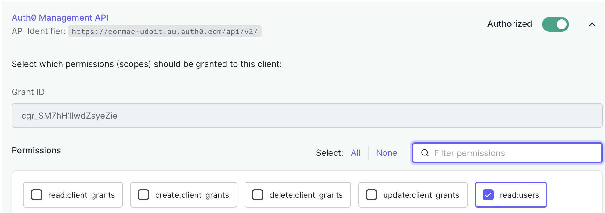
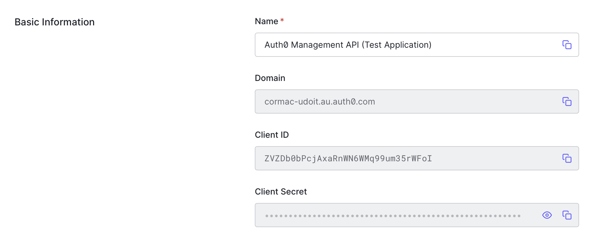

# Asynchronous Processing With Queues and Cron Jobs

The application includes an example [cron job](../packages/functions/src/cron.ts) and [event processor](../packages/functions/src/queue.ts).

The Cron job queries the `user` table and creates an SQS event for each user containing the user `id`.

The queue event handler processes each event by:

* Ignoring the event if the user `id` isn't in structure `auth0|xxxx`
* Calling the  auth0 `/api/v2/users/` API to retrieve user metadata.
* Updating the `user` table with the `last_login, last_ip and login_count` from Auth0.

## Enabling The Auth0 Synchronisation Job

### Create a Management API Application

To enable the cron job you will need to create an Application with credentials and permissions to call the Auth0 management APIs.

* Go to auth0.com
* Select APIs -> Auth0 Management API
* Test -> Create & Authorise Test Application
* Applications -> Auth0 Management API (Test Application)
* APIs -> Expand Permissions
* Select -> `read:users`
* Update



### Set Auth0 API Secrets

* Got To auth0.com
* Applications -> Auth0 Management API (Test Application)
* Select -> Settings



Add the Auth0 secrets as AWS Parameter Store secrets.

```bash
npx sst secrets set --stage <environment> AUTH0_DOMAIN <Domain>
npx sst secrets set --stage <environment> AUTH0_MGMT_CLIENT_ID <Client Id>
npx sst secrets set --stage <environment> AUTH0_MGMT_SECRET <Secret>
```