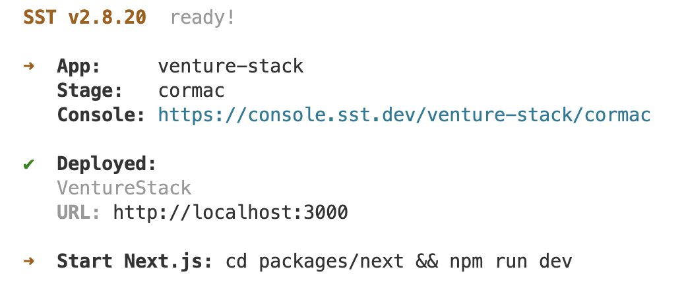
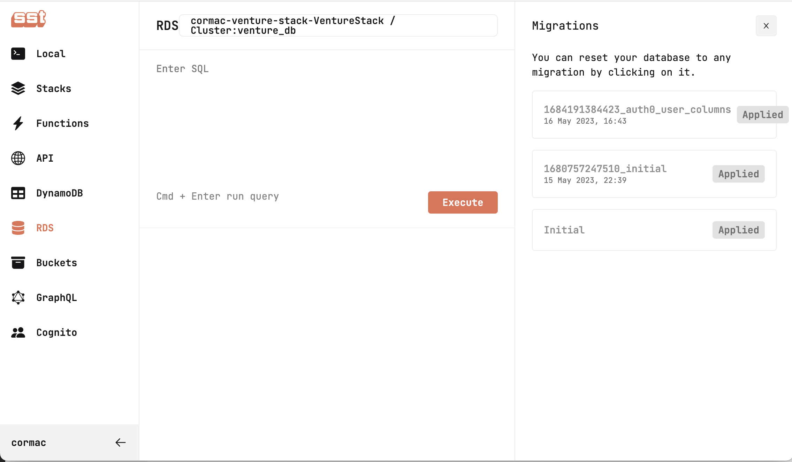

# Development

This guide will set up an environment with minimal dependencies for local development. The minimal configuration stores user credentials in RDS; never use this in production. You can find a guide to setting up Auth0 authentication [here](./AUTH.md).

## Prerequisites

If you are not interested in installing prerequisites on your local machine, no problem, we've got you; skip to the [Dev Containers](#devcontainers) or [CodeSpaces](#codespaces) sections.

Otherwise, follow these steps to install and configure your local machine.

### Install Node (OSX)

Step 1. Setup Homebrew

```bash
ruby -e "$(curl -fsSL https://raw.githubusercontent.com/Homebrew/install/master/install)" 
```

Step 2. Remove System Node Versions

```bash
brew uninstall --ignore-dependencies node 
brew uninstall --force node
```

Step 3. Install Node Version Manager (NVM)

```bash
brew update 
brew install nvm 
```

Add the below lines to ~/.bash_profile ( or ~/.zshrc for macOS Catalina or newer versions)

```vim
export NVM_DIR=~/.nvm
source $(brew --prefix nvm)/nvm.sh
```

Open a new terminal window, to reload your environment.

Step 4. Install Node 18

```bash
nvm install 18 
```

Step 5. Install Yarn

```bash
brew install yarn
```

## Create a Development Environment

Step 1. Install AWS CLI

```bash
brew install awscli
```

Step 2. Add AWS Credentials

You need to have an AWS account and [AWS credentials configured locally](https://docs.sst.dev/advanced/iam-credentials#loading-from-a-file).

Step 3. Start You Development Environment

You be prompted for a stage name, which defaults to your local username.

```bash
yarn install
yarn dev
```

Output:



Step 4. Apply Schema Migrations

The previous step will output the URL you can use to access the SST development console. Open this URL in Chrome, the console doesn't support Safari.

From the SST development console:

* Navigate to RDS
* Select the `venture_db` database
* Select migrations
* Click apply



Step 5. Start Next.Js

```bash
yarn workspace @venture-stack/next dev
```

## Container-Based Development

### Devcontainers

A `devcontainer` is a lightweight, portable, and self-contained development environment you can use to build, test, and debug applications consistently and reproducibly across different machines and operating systems.

A `devcontainer` includes all the tools, libraries, and dependencies required to run an application, such as compilers, interpreters, runtime environments, editors, and extensions. It's defined using a Dockerfile file that specifies the components of the environment, and it can be customized and shared with other developers.

To work with the project in a local devcontainer, in VSCode:

* Open Remote Explorer
* Dev Containers
* Open Folder In Container

### Codespaces

Github Codespaces is a service that provides on-demand access to a development environment in the cloud. Access to the remote environment is completely seamless using VSCode. VSCode makes a remote environment behave like a local environment by automatically handling things like port forwarding. You can find more information on CodeSpaces [here](https://www.omahony.id.au/tech/2022/04/28/remote-dev-with-codespaces.html)

To work with the project in Codespaces:

* Go to [https://github.com/codespaces](https://github.com/codespaces)
* Create Codespace
* Select x15-coop/venture-stack repository
* Select 4-core, 16GB RAM, 32 GB

Once a Codespaces starts, you will be prompted to open it in VSCode.

By default, a Codespace will shut down when you stop interacting with it for 30 minutes. Codespaces will stop all running processes on shutdown, which can be annoying. You can increase this by clicking your GitHub Profile -> Settings -> Codespaces -> Default Idle Timeout.
